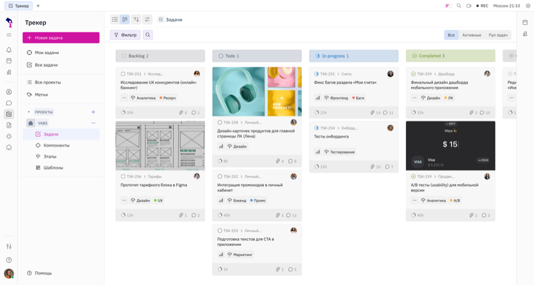

<h1 align="center">
   
  Интабия Платформа
</h1>

  <b>AI-платформа командной работы</b> 
  Задачи, чат, документы, виртуальный офис и ИИ-ассистент - в одном продукте, с открытым кодом и on-premise установкой.

  <a href="https://platform.intabia.ru">Сайт</a> ·
  <a href="https://github.com/intabia-fusion/platform">Исходный код</a> ·
  <a href="https://github.com/intabia-fusion/platform-docs">Документация</a> ·
  <a href="https://github.com/intabia-fusion/platform-selfhost">Self-hosting</a>

  

## Репозитории

| Репозиторий | Описание |
| --- | --- |
| [platform](https://github.com/intabia-fusion/platform) | Монорепозиторий: платформа и все приложения |
| [platform-docs](https://github.com/intabia-fusion/platform-docs) | Документация |
| [platform-selfhost](https://github.com/intabia-fusion/platform-selfhost) | Развёртывание на своей инфраструктуре |
| [platform-examples](https://github.com/intabia-fusion/platform-examples) | Примеры работы с REST и WebSocket API |

Развитие [hcengineering/platform](https://github.com/hcengineering/platform), которое ведёт
Intabia вместе с бывшими владельцами и инженерами hcengineering. TypeScript, Svelte,
Node.js, Docker. Лицензия Eclipse Public License 2.0.
